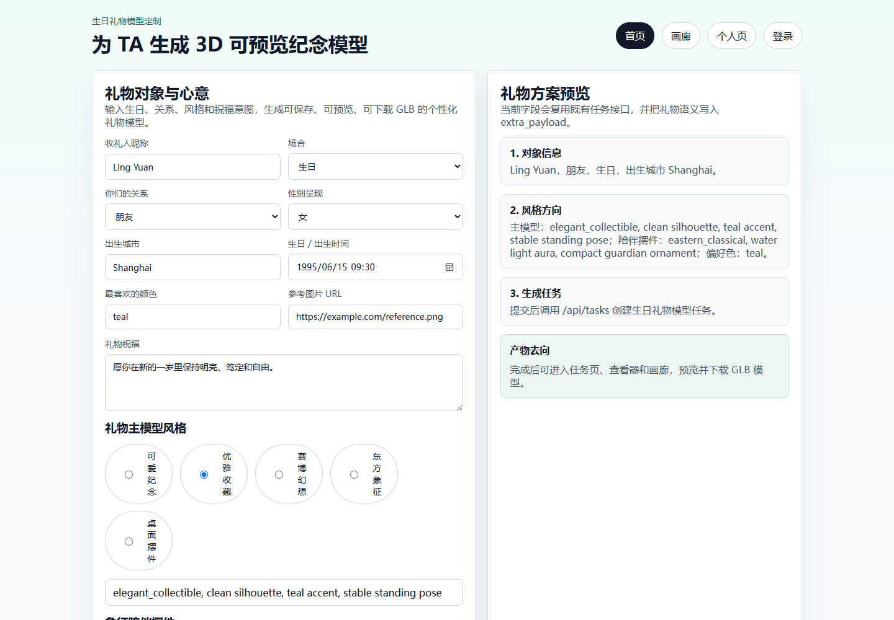
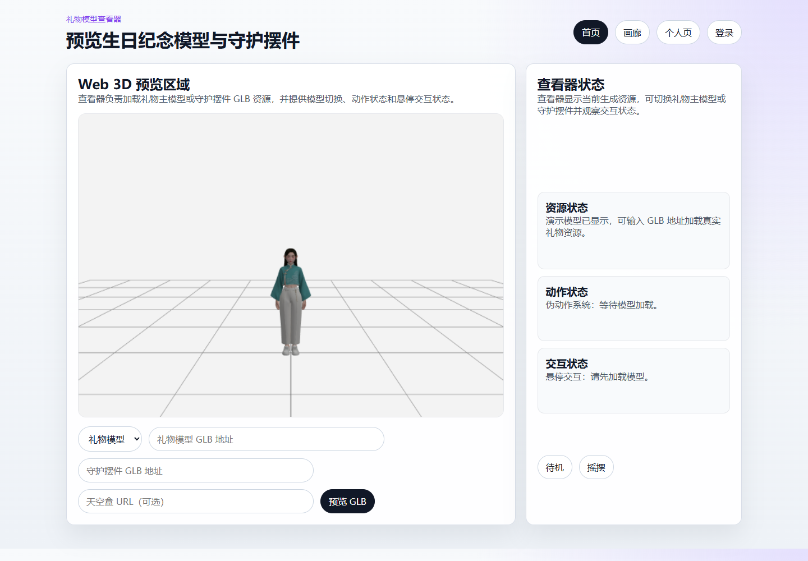
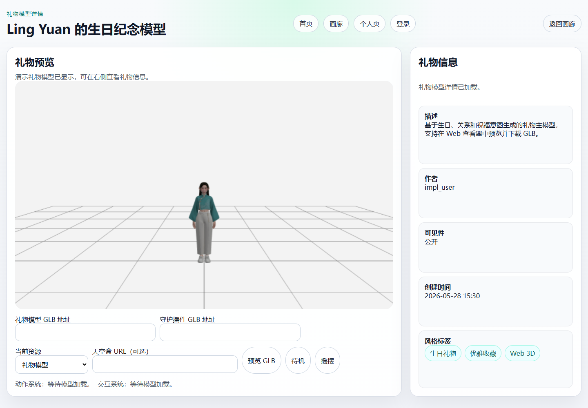
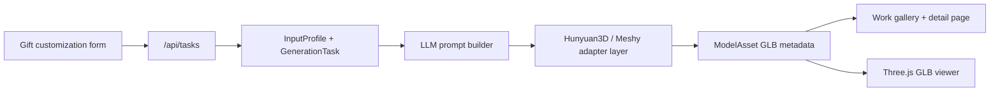

# Bazi3D

Bazi3D is an AI-personalized 3D birthday gift model customization demo. Users enter recipient birthday context, relationship, style preferences, blessing intent, and optional reference imagery; the system turns those signals into structured LLM prompts and GLB-previewable 3D keepsake assets.

The project is positioned as a job-search portfolio case study for an AI + 3D product workflow: input recipient context -> generate semantic prompt -> generate GLB assets -> preview/save/download. It keeps the implementation honest: Bazi3D currently supports GLB preview/download and print-aware prompt constraints, while print vendor ordering, STL validation, and e-commerce checkout are future non-goals.

## Implemented Features

- Birthday gift customization form with recipient, relationship, blessing, favorite color, style preset, and reference image inputs.
- LLM prompt builder that produces structured `character` and `guardian_spirit` design packages.
- Print-aware prompt constraints for stable poses, complete silhouettes, readable large forms, and GLB-ready geometry.
- Generation task API and status tracking.
- Provider adapter layer for Hunyuan3D and Meshy-style 3D generation integrations.
- Model asset persistence, gallery listing, work detail pages, and GLB viewer integration.
- Authentication, user-owned works, account export, account deletion, and evaluation logging.
- Automated backend and frontend shell tests.

## Demo Path

1. Open `http://127.0.0.1:5001/create.html`.
2. Fill the birthday gift customization form.
3. Submit a generation task after logging in.
4. Inspect the task status page.
5. Preview GLB assets in `viewer.html`.
6. Review saved gift models in `work.html?demo=1` or the gallery.

## Screenshots





## Architecture



## Implementation Evidence

- `backend/routes/tasks.py`: task creation and task status API.
- `backend/prompt/builder.py`: structured gift prompt construction.
- `backend/services/generation_worker.py`: generation orchestration and asset persistence.
- `backend/adapters/hunyuan3d_adapter.py`: Hunyuan3D adapter boundary.
- `backend/models/model_asset.py`: GLB model asset metadata model.
- `frontend/create.html`: birthday gift customization entry.
- `frontend/viewer.html`: Three.js GLB preview surface.
- `tests/test_generation_worker.py`: worker and generated asset behavior coverage.

## Local Run

### 1. Prepare Python Environment

```powershell
python -m venv .venv
.venv\Scripts\Activate.ps1
pip install -r requirements.txt
```

### 2. Configure Environment Variables

```powershell
Copy-Item .env.example .env
```

Then update `.env` with local values as needed:

- `SQLALCHEMY_DATABASE_URI` or MySQL connection fields
- `JWT_SECRET_KEY`
- `CORS_ALLOWED_ORIGINS`
- optional provider keys such as `DEEPSEEK_API_KEY`, `MESHY_API_KEY`, `TENCENTCLOUD_SECRET_ID`, `TENCENTCLOUD_SECRET_KEY`

### 3. Initialize the Database

```powershell
python init_db.py
```

### 4. Start the App

On Windows, run with the project root on `PYTHONPATH`:

```powershell
$env:PYTHONPATH="."
python backend/app.py
```

Default local entry points:

- Backend health check: `http://127.0.0.1:5001/health`
- Gift customization entry: `http://127.0.0.1:5001/app`
- Direct create page: `http://127.0.0.1:5001/create.html`

## Current Scope and Non-Goals

Bazi3D currently demonstrates a portfolio-ready product loop for personalized 3D birthday gift model planning, GLB asset tracking, browser preview, and download-oriented presentation.

The project does not yet implement:

- STL validation or production printability checks.
- Print vendor ordering or fulfillment integration.
- E-commerce checkout.
- A production marketplace or inventory system.

## Tech Stack

- Backend: Python 3.11+, Flask, SQLAlchemy, PyMySQL/SQLite for local checks.
- Frontend: static HTML, CSS, vanilla JavaScript.
- Viewer: Three.js modules for GLB loading and interaction.
- AI / 3D generation: LLM prompt planning with Hunyuan3D and Meshy-style adapter scaffolding.
- Testing: Python `unittest`.

## Repository Structure

- `backend/`: Flask app, routes, services, adapters, models, and prompt generation logic.
- `frontend/`: static product pages and browser-side scripts.
- `tests/`: backend and frontend shell tests.
- `docs/product/`: product plans, release notes, legal readiness, and portfolio packaging notes.
- `init_db.py`: local database initialization script.

## Public Repository Notes

Before pushing publicly, do not commit private or local-only artifacts:

- `.env`
- local virtual environments
- IDE metadata such as `.idea/`
- cache, log, build, and temporary output artifacts
- private planning, review, or requirement documents
